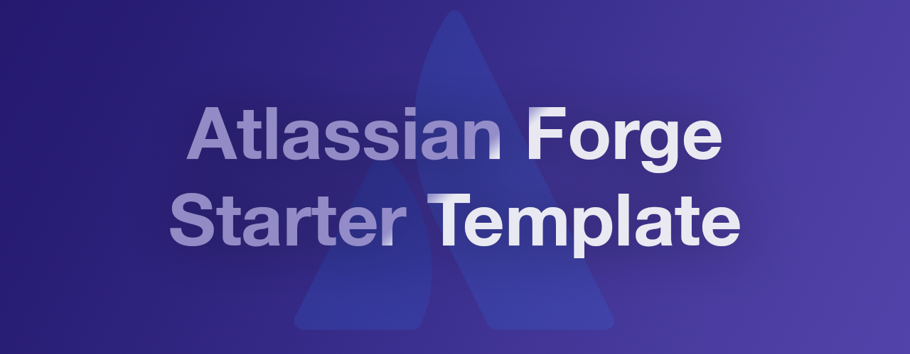

# ForgeStarter




⚡️ A feature-packed, opinionated starter template for building Atlassian Forge apps. Includes Yarn, Vite, React 18, TypeScript, Vitest, Testing Library, Playwright, Eslint, and Atlaskit — everything you need to get started with modern tooling and best practices.

This repository follows the principle of **"Grab It All – Use Only What You Need"**.
It enables you to quickly start building Forge apps for **Jira, Confluence, Bitbucket**, or even a single app that integrates with all three applications.  


## Getting Started

### 0. Prerequisites

Before you begin, ensure you have the following installed:

1. [Node.js](https://nodejs.org/en/download/package-manager)
2. [Yarn](https://yarnpkg.com/)
3. [Forge CLI](https://developer.atlassian.com/platform/forge/getting-started/)

### 1. Install Dependencies

Run the following command to install the necessary dependencies:

```bash
yarn install
```

### 2. Initial Build

To create the initial build, run one of the following commands, depending on the app version you'd like to start with:

```bash
yarn build:jira   # For Jira app version
yarn build:conf   # For Confluence app version
yarn build:bitb   # For Bitbucket app version
```


### 3. Register, Deploy, Install

#### Register the app with Forge:

```bash
yarn forge:register:jira # For Jira version
yarn forge:register:conf # For Confluence version
yarn forge:register:bitb # For Bitbucket version
```

#### Deploy to Forge

Deploy the app to the development environment:

```bash
yarn forge:deploy:jira # For Jira version
yarn forge:deploy:conf # For Confluence version
yarn forge:deploy:bitb # For Bitbucket version
```

#### Install the App on Your Cloud Instance

Install the app on your cloud instance by running:

```bash
yarn forge:install:jira # For Jira version
yarn forge:install:conf # For Confluence version
yarn forge:install:bitb # For Bitbucket version
```

Follow the on-screen instructions to complete the process. 
The Forge app should now be installed from the development environment and available on your cloud instance.


## Available Scripts and additional parameters

### Deploy

To deploy to another environment (e.g., staging or production), append the environment flag:

```bash
yarn forge:deploy:jira -e staging     # For staging
yarn forge:deploy:jira -e production  # For production
yarn forge:deploy:conf -e staging     # For staging
yarn forge:deploy:conf -e production  # For production
```


### Test

`yarn test`


### Lint

- Check for linting issues:
  ```bash
  yarn lint
  ```
- Automatically fix linting issues:
  ```bash
  yarn lint:fix
  ```


# Development Workflow

Once the app is installed (see Getting Started), follow this development loop:

1. Start the Custom UI with hot reloading and establish a Forge tunnel to redirect requests to localhost:
    ```bash
    yarn dev:jira   # For Jira version
    ```

    or

    ```bash
    yarn dev:conf   # For Confluence version
    ```
2. Make changes to your app and enjoy instant feedback with hot-reloading.
3. After major changes to the `manifest.yml`, deploy and reinstall the app:
    ```bash
    yarn forge:deploy:jira   # For Jira version
    yarn forge:install:jira --upgrade  # For Jira version
    ```

    or

    ```bash
    yarn forge:deploy:conf   # For Confluence version
    yarn forge:install:conf --upgrade   # For Confluence version
    ```

# Folders structure

```bash
└── packages # all workspaces of your monorepo project
    └── forge-jira # Jira Forge app
        ├── manifest.yml # main manifest file
        └── src # Forge FAAS, resolvers, UI Kit modules, web triggers, custom fields, workflow postfunctions, and so on
        └── ...
    └── forge-conf # Confluence Forge app
        ├── manifest.yml # main manifest file
        └── src # Forge FAAS, resolvers, UI Kit modules, web triggers and so on
        └── ...
    └── forge-bitb # Bitbucket Forge app
        ├── manifest.yml # main manifest file
        └── src # Forge FAAS, resolvers, UI Kit modules, and so on
        └── ...
    └── shared # shared types, consts
        └── ...
    └── ui # Custom UI for all apps
        └── ...
    └── e2e # E2E tests for ui
        └── ...
└── .gitignore
└── bitbucket-pipelines.yml # Github pipelines configuration file example (self hosted runner)
└── eslint.config.js # Single eslint config file for all apps
└── tsconfig.base.json # Base TypeScript config file for all apps
└── package.json # overall workspace configuration and dependencies
```

# FAQ

<details>
  <summary><strong>Why is my app NOT eligible for the Runs on Atlassian program?</strong></summary>

  **Short answer:**  
  Your app's manifest file (`manifest.yml`) must not include any entries under the `permissions -> external` section.

  For more details about the Runs on Atlassian program, please visit the [https://go.atlassian.com/runs-on-atlassian](https://go.atlassian.com/runs-on-atlassian).
</details>

<details>
  <summary><strong>Dev Routines</strong></summary>

   1. **Upgrade dependencies interactively**  
    Use [`yarn upgrade-interactive`](https://classic.yarnpkg.com/en/docs/cli/upgrade-interactive/) to update your dependencies to the latest versions in a controlled way.
   2. **Find unused files, dependencies, and exports**  
    Use `yarn knip` to detect unused code. ⚠️ *Note: There may be false positives — review the results carefully before removing anything.*
   3. **Refresh the lockfile**  
    Run `yarn install --refresh-lockfile` to regenerate the `yarn.lock` file.  
    This is helpful for:
      - Upgrading Yarn versions
      - Fixing "ghost" dependencies stuck in the lockfile
   4. **Visualize your Vite bundle**  
    Use `npx vite-bundle-visualizer` to analyze and optimize your Vite build output. 

</details>

<details>
  <summary><strong>UI Kit is not compatible with React 19</strong></summary>

  This is a known issue — Atlassian is gradually updating UI Kit to support newer versions of React, but as of now, only React 18 is officially supported. 

  The good news is that you can still use React 18 for your UI Kit-based frontend resources, while using a different React version (including React 19) for any Custom UI resources in your app.
</details>


# License

This project is licensed under the MIT License.
